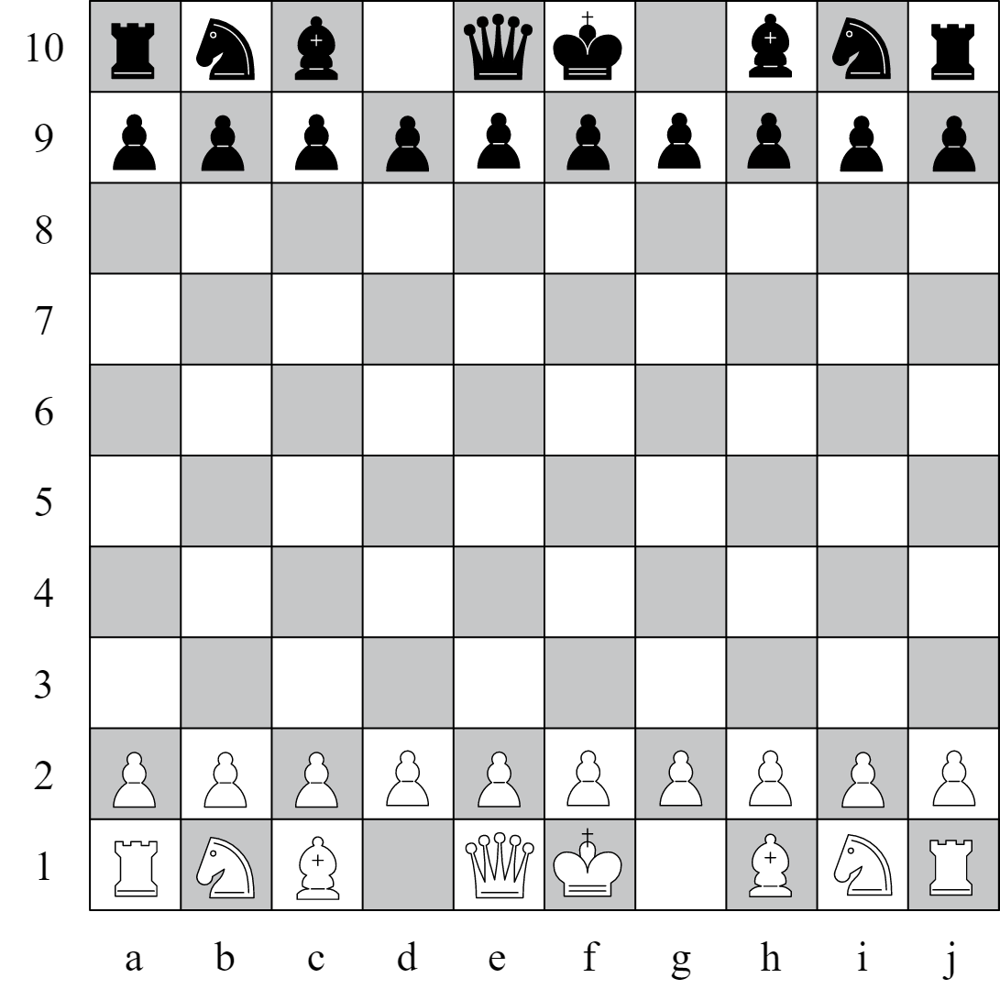

# JEU D'ECHEC EN JAVA

>## Quelques règles du code à retenir :
>### Entités : 
>> - Plateau
>> - Pieces (Pion, Roi, Dame, Cavalier, Fou, Tour)
>> - Players
>> - Cases
>> - Coordonnes
>> - Couleurs
>> - Mouvements
>### Plateau : 
>
>> - Un plateau contient toutes les **Cases** qui contiennent les **Coordonnées** et la capacité d'accueil d'une pièce.
>> - Les *X* sont les lettres (horizontal) et les *Y* sont les chiffres (vertical) sur le plateau.
>> - Les coordonnées sont toujours de type *'String'*.
>>> #### Cases : 
>>> - Une case est identifiable par ses coordonnées et par son état (libre ou occupée)
>>
>>> #### Coordonnées : 
>>> - Une coordonnée est composée d'une lettre (ligne horizontale) et d'un chiffre (ligne verticale) 
>
>### Pièces : 
>
>> - Une piece contient une liste de mouvements valides ne contenant pas les attaques, celles-ci sont contenues dans une autre liste
>> - Tous les mouvements sont revérifiés à chaque tour pour chaque pièce du plateau
>> - Une piece est identifiable par sa couleur son type et ses coordonnées
>> - Les pièces blanches sont placées dans le sens alphabétique
>### Mouvements : 
>> - Un mouvement contient des coordonnées de départ et d'arrivée
>> - Il peut être une attaque
>### Players : 
>> - Un players est défini par sa couleur
>> - Il peut être humain ou IA
>> - Il contient toutes les pièces de sa couleur
>> - Il a la capacité de gérer ses pièces et de choisir les mouvements

## TODO :
> - [ ] Initialisation des types de pièces
> - [ ] Initialisation des Players humains
> - [ ] Compte rendu complet du jeu sous format doc
> - [ ] Affichage du plateau
> - [ ] Construction et affichage d'un plateau vide
> - [ ] Evolution avec affichage des pieces sur le plateau
> - [ ] Evolution avec affichage des mouvements valides pour chaque pièce
> - [ ] Gestion du déroulement sur un seul tour
> - [ ] Mouvement d'une pièce sans joueur et sans attaque
> - [ ] Vérification du changement d'état des mouvements valides
> - [ ] Gestion du déroulement sur plusieurs tours 
> - [ ] Attaque d'une pièce sans joueur
> - [ ] Vérification du changement d'état des mouvements valides
> - [ ] Vérification du changement d'état de la pièce hors-jeu
> - [ ] Ajout de 2 joueurs (humains)
> - [ ] Contrôle d'une pièce par un joueur
> - [ ] Gestion de l'état du jeu
> - [ ] Affichage de l'état du jeu
> - [ ] Arrêt d'une partie
> - [ ] Création d'une première IA d'évaluation simple
> - [ ] Gestion des pièces par l'IA
> - [ ] Compte rendu des stats de cette IA
> - [ ] Création d'une deuxième IA et gestion des pièces
> - [ ] Affrontement des deux IA dans deux couleurs différentes et compte rendu des stats de ces parties
> - [ ] Gestion des messages d'erreurs
> - [ ] Affichage avancé du jeu (gestion FX ?)

## Doing : 
> - [ ] Initialisation des types de pièces
> - Roi gestion des bordures
> - Pion
## Done : 
> - [x] Initialisation des Couleurs